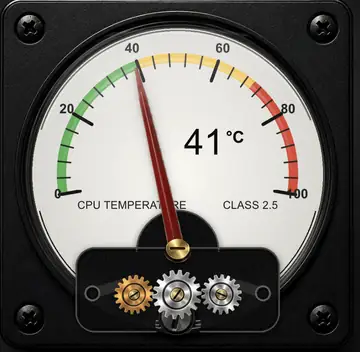

# Analog Gauge Card

<picture>
  <source media="(prefers-color-scheme: dark)" srcset="brand/dark_logo.svg">
  
</picture>

A photorealistic, reusable analog gauge for Home Assistant dashboards with a moving needle, animated mechanically matched gears, configurable scale geometry, value labels and coloured operating zones.

## Project branding

This repository contains project-specific brand assets under [`brand/`](brand/):

- `icon.svg`
- `logo.svg`
- `dark_logo.svg`

Analog Gauge Card is a **Home Assistant Dashboard plugin (custom Lovelace card)**, not a `custom_components` integration. Therefore these files are used for the repository, documentation and project identity; Home Assistant's integration brands mechanism does not automatically attach them to a dashboard card.

## Current Home Assistant rendering

The preview below is the actual card rendered in Home Assistant with the final documented CPU-temperature configuration.



## Features

- Photorealistic black instrument housing, screws, glass, dial and mechanical section
- Smooth animated needle based on any numeric Home Assistant entity
- Three animated gears with matching direction and transmission ratios
- Scale centred independently from the needle pivot
- Configurable range, ticks, labels, title, subtitle and unit
- Automatic value relocation when the needle would cover the number
- Unit can follow the relocated value
- Automatic scale fitting inside the white dial
- Configurable colour zones
- Responsive rendering for desktop, tablet and mobile dashboards
- Photorealistic visual assets are installed together with the JavaScript file under `dist/assets/`

## Installation with HACS

1. Open **HACS → Dashboard**.
2. Open the three-dot menu and select **Custom repositories**.
3. Add `https://github.com/loungelizard2018/analog-gauge-card`.
4. Select category **Dashboard**.
5. Install **Analog Gauge Card**.
6. Reload Home Assistant when HACS asks you to do so.

HACS downloads `dist/analog-gauge-card.js` and normally registers the dashboard resource automatically.

## Manual installation

1. Copy the complete contents of `dist/` to `/config/www/analog-gauge-card/`.
2. Add `/local/analog-gauge-card/analog-gauge-card.js` as a **JavaScript Module** under **Settings → Dashboards → Resources**.
3. Reload the browser without cache.

## Minimal example

```yaml
type: custom:analog-gauge-card
entity: sensor.bigpool_cpu_temperature
min: 0
max: 100
unit: "°C"
title: "CPU TEMPERATURE"
subtitle: "CLASS 2.5"
zones:
  - from: 0
    to: 40
    color: "#4caf50"
  - from: 40
    to: 70
    color: "#f6c343"
  - from: 70
    to: 100
    color: "#df4332"
```

## Complete documented reference card

Use [`examples/cpu-temperature-complete.yaml`](examples/cpu-temperature-complete.yaml) as the final reference configuration. It contains the exact values used for the preview and detailed comments explaining every geometry and rendering option.

## Important geometry model

The scale and the needle use separate centres:

- `scale_center_x` / `scale_center_y` define the curvature of the complete scale around the dial.
- `pivot_x` / `pivot_y` define the mechanical rotation point of the needle.
- With `needle_length_mode: touch`, the card calculates the target point on the scale and adjusts the visible needle length slightly so its tip follows the scale.
- With `scale_fit: auto`, the requested scale radius is reduced when labels or ticks would leave the white dial.

## Configuration reference

| Option | Default | Purpose |
|---|---:|---|
| `entity` | required | Numeric Home Assistant entity |
| `min`, `max` | `0`, `100` | Gauge value range |
| `unit` | entity unit | Display unit |
| `title`, `subtitle` | empty / `CLASS 2.5` | Dial legends |
| `decimals` | `0` | Value decimals |
| `major_ticks` | `6` | Number of labelled scale marks including endpoints |
| `minor_ticks` | `4` | Small marks between major ticks |
| `pivot_x`, `pivot_y` | `512`, `700` | Needle rotation point |
| `scale_center_x`, `scale_center_y` | `512`, `500` | Independent scale centre |
| `scale_radius` | `350` | Requested scale radius |
| `scale_start_angle`, `scale_end_angle` | `-100`, `100` | Scale angular span |
| `scale_fit` | `auto` | Keep the complete scale inside the dial |
| `dial_center_x`, `dial_center_y`, `dial_radius` | `512`, `500`, `400` | Physical white dial geometry |
| `dial_margin` | `14` | Safety margin from dial edge |
| `zone_width` | `24` | Coloured arc width |
| `major_tick_length`, `minor_tick_length` | `54`, `32` | Tick lengths |
| `tick_outset` | `10` | Tick position relative to arc |
| `label_offset` | `18` | Base distance of scale labels |
| `label_radial_adjust` | `4` | Fine radial label adjustment |
| `label_end_inset` | `28` | Extra inward offset for min/max labels |
| `label_safety` | `30` | Label-size allowance used by auto-fit |
| `needle_length_mode` | `touch` | `touch` or `fixed` |
| `needle_length` | `560` | Fixed needle length |
| `needle_reach` | `-5` | Needle tip offset from scale target |
| `value_position` | `auto` | `auto`, `left` or `right` |
| `value_left_x`, `value_right_x`, `value_y` | configurable | Value positions |
| `unit_position` | `relative` | `relative` or `absolute` |
| `unit_offset_x`, `unit_offset_y` | configurable | Unit offset from value |
| `title_x`, `subtitle_x`, `text_y` | configurable | Legend coordinates |
| `gear_y` | `810` | Vertical gear position |
| `gear_turns` | `2` | Centre gear turns across full range |
| `max_width` | `720` | Maximum responsive card width |
| `zones` | three defaults | Coloured value ranges |

## Updating from the pre-HACS V4.1.2 file

The HACS package uses the stable type:

```yaml
type: custom:analog-gauge-card
```

For migration convenience, the JavaScript also provides the old alias:

```yaml
type: custom:analog-gauge-card-v412
```

Remove old manually configured V4.x dashboard resources after HACS has registered the new resource. Keeping several old gauge resources loaded can cause unnecessary downloads and confusing browser caches.

## Development check

```bash
npm run check
```

## Licence

MIT
